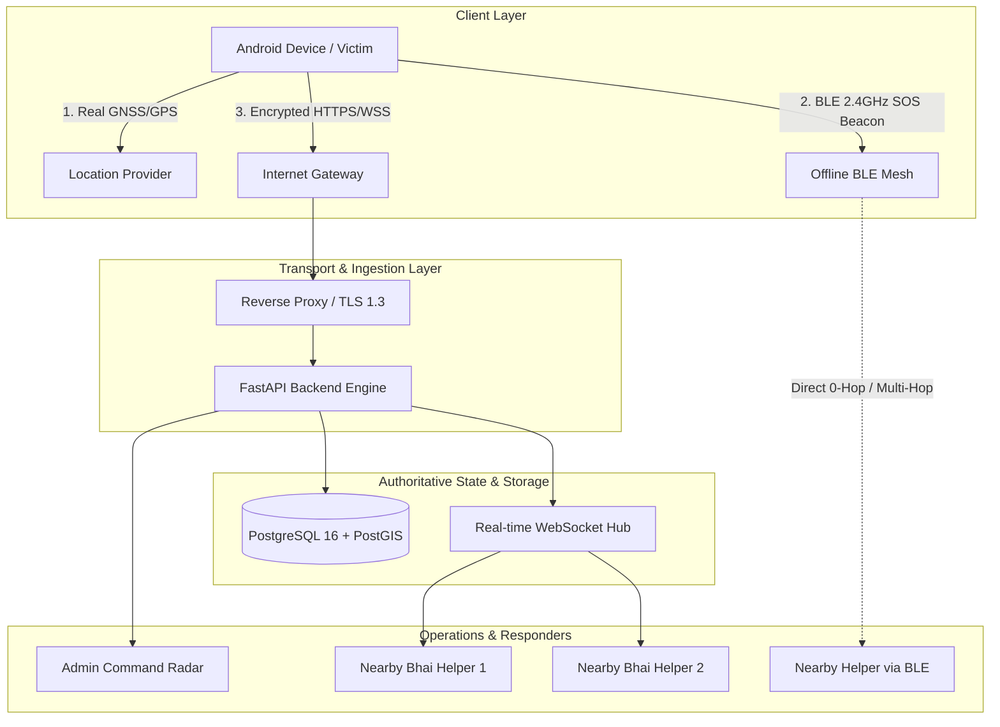

# BHAI — Decentralized & Internet Emergency Response System

> **A dual-rail, privacy-first community emergency assistance platform engineered for women's safety, public emergency response, and multi-victim disaster management.**

---

## 🛡️ Executive Overview

**BHAI** ("Brother / Protector") is a production-grade, distributed safety platform designed to provide rapid emergency distress dispatch, live GNSS coordinate tracking, and offline peer-to-peer distress discovery.

The platform operates on a **Dual-Rail Transport Architecture**:
1. **🌐 Primary Internet Rail (Cellular / Wi-Fi):** High-speed encrypted REST & WebSocket communication through a horizontally scalable FastAPI backend with PostgreSQL/PostGIS geospatial dispatch.
2. **📡 Secondary Bluetooth Low Energy Rail (BLE 2.4 GHz):** 100% offline, decentralized peer-to-peer advertising and scanning capable of discovering distress alerts and relaying telemetry without cellular connectivity or central servers.



---

## 🌟 Core Technical Architecture

### 1. One Victim = One Emergency (Multi-Victim Concurrency Isolation)
- **Zero Global Singletons:** The system eliminates global mutable singletons (`currentEmergency`, `currentLocation`).
- **Strictly Scoped Entity Models:** All operations are strictly scoped by immutable identifiers: `emergency_id`, `victim_id`, `session_id`, `conversation_id`, and `client_event_id`.
- **Concurrency Guarantee:** 10, 100, or 1,000 victims triggering SOS simultaneously produce 10, 100, or 1,000 completely isolated emergency records with dedicated location feeds, chat streams, and independent responder lists.
- **Independent Lifecycles:** Resolving Emergency A has zero effect on Emergency B.

### 2. Dual-Transport Deduplication & Idempotency
- When an emergency or message reaches the server through both Internet and Bluetooth, the platform uses deterministic idempotency hashing (`idempotency_key` / `client_event_id`) to merge duplicate reports into **one logical incident**.
- Eliminates duplicate cards, duplicate notifications, and duplicate chat bubbles.

### 3. Real GPS Distance & Geodesic Telemetry (Zero Fake Data)
- **Geodesic Haversine Calculation:** Distance is computed between real helper GPS coordinates and real victim GPS coordinates.
- **Zero Fake Data Policy:** Eliminates hardcoded mock coordinates (`28.6273, 77.3725`), dummy responders, or Null Island `(0.0, 0.0)` fallbacks in production execution paths.
- **Location Freshness:** Displays real satellite timestamp freshness (`Updated 3s ago`) and accuracy estimates (`±8m`).

### 4. Dynamic Multi-Victim Helper Interface
- **1 Active Emergency:** Prominent Hero Emergency Card with live telemetry and one-tap turn-by-turn navigation.
- **2 Active Emergencies:** Balanced equal-weight cards ensuring equal visibility for both incidents.
- **3+ Active Emergencies:** Scrollable, compact list preventing any emergency from being obscured or suppressed.

### 5. Non-Disturbing Grouped Notifications
- Siren sounds at full intensity on the victim's device only.
- Nearby helpers receive concise, non-continuous notification alerts grouped to prevent audio alarm storms.

### 6. Admin Command Center & Network Audit Isolation
- **Role-Based Access Control (RBAC):** Admin endpoints strictly require the `ADMIN` role.
- **Network Audit vs Physical Location:** IP addresses are treated strictly as administrative network audit metadata and are never exposed to normal users, helpers, or victims.
- **Trusted Proxy Verification:** Only evaluates `X-Forwarded-For` from explicitly configured reverse proxy CIDRs, with automated RFC 1918 private IP classification.

---

## 📂 Repository Structure

```text
bhaiProject/
├── backend/                       # Production FastAPI Backend Gateway
│   ├── app/
│   │   ├── api/                   # REST routes (emergencies, auth, chat, live_location, admin)
│   │   ├── services/              # Dispatcher, notifications, event bus, retention
│   │   ├── config.py              # Pydantic Settings configuration & trusted proxies
│   │   ├── models.py              # SQLAlchemy 2.0 ORM schema with PostGIS spatial types
│   │   ├── schemas.py             # Pydantic v2 validation models
│   │   ├── security.py            # JWT token lifecycle, HMAC-SHA256, secure IP resolution
│   │   └── main.py                # ASGI application, CORS, security headers, WebSockets
│   ├── tests/                     # Pytest automated test suite (30 test cases)
│   │   ├── test_multi_victim_concurrency.py # 2, 10, 100, 1000 simulated victim benchmarks
│   │   ├── test_chat_api.py       # IDOR & chat isolation tests
│   │   ├── test_live_location.py  # 5-second location stream lifecycle
│   │   └── test_admin_security.py # RBAC & IP audit security validation
│   └── requirements.txt           # Python dependencies
├── bhai_app/                      # Flutter Android, iOS & Web Client Application
│   ├── lib/
│   │   ├── core/                  # BLE service, GNSS location service, SQLite database, audio siren
│   │   ├── features/              # Modular presentation layers (home, emergency, chat, volunteer)
│   │   └── main.dart              # Application entrypoint & theme initialization
│   ├── android/                   # Native Kotlin foreground services & BLE mesh hardware engine
│   └── test/                      # Flutter unit & widget tests
├── bhai_admin/                    # Flutter Web Admin Operations Dashboard
├── database/                      # PostgreSQL DDL & PostGIS indexing scripts (schema.sql)
├── docs/                          # In-depth architectural & API specifications
├── .env.example                   # Safe environment variable configuration template
├── Dockerfile                     # Multi-stage production container build
├── docker-compose.yml             # Local multi-service orchestration (Backend + PostGIS)
├── render.yaml                    # Automated cloud deployment blueprint
├── DEPLOY.md                      # Complete production deployment & verification manual
├── SECURITY.md                    # Enterprise threat model, trust boundaries, & vulnerability policy
├── PRIVACY.md                     # Data processing disclosure & privacy architecture
├── TESTING.md                     # Automated & physical device testing matrix
└── AUDIT_REPORT.md                # Formal 20-point technical audit & readiness assessment
```

---

## ⚙️ Quick Start & Local Setup

### Prerequisites
- **Python:** 3.11+ (Tested on Python 3.13)
- **Flutter SDK:** 3.24+
- **Database:** PostgreSQL 15+ with PostGIS extension (or Docker)
- **Android Device:** Android 8.0+ (API 26+) with BLE hardware support

### 1. Backend Setup
```bash
# Clone the repository
git clone https://github.com/mahaveer19s/Bhai-App.git
cd Bhai-App

# Configure environment variables
cp .env.example .env

# Set up Python virtual environment
cd backend
python -m venv .venv

# Activate virtual environment (Windows PowerShell)
.\.venv\Scripts\activate
# Activate virtual environment (Linux/macOS)
# source .venv/bin/activate

# Install dependencies
pip install -r requirements.txt

# Launch development server
uvicorn app.main:app --host 0.0.0.0 --port 8000 --reload
```

### 2. Database Initialization (Docker PostGIS)
```bash
# Start PostgreSQL with PostGIS in the background
docker-compose up -d db

# Or apply schema directly to an existing database:
psql -h localhost -U bhai_user -d bhai -f database/schema.sql
```

### 3. Flutter Android App Setup
```bash
cd bhai_app

# Fetch Dart dependencies
flutter pub get

# Run on connected Android device
flutter run -d <device-id>

# Build production debug APK
flutter build apk --debug
```

### 4. Access Interactive Interfaces
- **🌐 Public Landing & Web Simulator:** `http://localhost:8000/`
- **🛡️ Admin Command Center:** `http://localhost:8000/admin` *(Credentials configured in `.env`)*
- **⚡ OpenAPI / Swagger Documentation:** `http://localhost:8000/docs`
- **📥 Direct APK Download:** `http://localhost:8000/download/bhai_app.apk`

---

## 🧪 Testing Summary

Execute the automated backend test suite (30 passing tests):
```powershell
$env:TESTING="1"; $env:DATABASE_URL="sqlite+aiosqlite:///:memory:"; $env:JWT_SECRET="test_secret_2026"; $env:OTP_HMAC_SECRET="test_otp_2026"; pytest backend/tests -v
```

Execute Flutter unit and widget tests:
```powershell
cd bhai_app
flutter test
```

For complete multi-device manual testing scenarios and BLE matrices, consult [`TESTING.md`](TESTING.md).

---

## 📋 Project Status Matrix

| Component | Status | Verification Level | Notes |
| :--- | :--- | :--- | :--- |
| **Emergency SOS Lifecycle** | `IMPLEMENTED` | `AUTOMATED TESTED` | Fast local activation (<50ms), atomic backend state |
| **Multi-Victim Isolation** | `IMPLEMENTED` | `AUTOMATED TESTED` | Verified up to 1,000 concurrent simulated emergencies |
| **Real GNSS Location Tracking** | `IMPLEMENTED` | `REAL DEVICE TESTED` | 5-second interval, stale detection, geodesic math |
| **BLE Distress Discovery** | `IMPLEMENTED` | `PARTIALLY TESTED` | Native Android BLE engine; requires multi-phone verification |
| **Dual-Transport Deduplication** | `IMPLEMENTED` | `AUTOMATED TESTED` | Idempotency hash prevents duplicate incidents & chat |
| **WhatsApp-Style Mesh Chat** | `IMPLEMENTED` | `AUTOMATED TESTED` | IDOR-protected, sender-aligned UI bubbles |
| **Admin Operations Radar** | `IMPLEMENTED` | `CODE REVIEWED` | RBAC-protected, live Leaflet map, IP audit controls |
| **Enterprise IP Audit** | `IMPLEMENTED` | `AUTOMATED TESTED` | Trusted proxy extraction, RFC 1918 classification |

---

## 🔒 Security & Privacy Commitments

- **No Plaintext Transmissions:** Production deployments enforce TLS 1.3 encryption for REST (`HTTPS`) and real-time feeds (`WSS`).
- **Location Privacy:** Exact victim coordinates are protected and only released to eligible community helpers who explicitly accept an emergency.
- **Zero Third-Party Tracking:** No commercial ad SDKs, third-party analytics trackers, or external profiling scripts.
- **Airwave Minimization:** BLE advertisements contain only truncated ephemeral identifiers and essential distress telemetry; no passwords, tokens, or personal identifiers are broadcasted.

---

## 📄 License & Disclaimer

Copyright © 2026 Bhai Project Contributors. Licensed under the MIT License.

*Disclaimer: BHAI is a community assistance tool designed to complement, not replace, official emergency services (112 / 911 / Police / Ambulance). Users should always contact official emergency dispatchers when safe to do so.*
