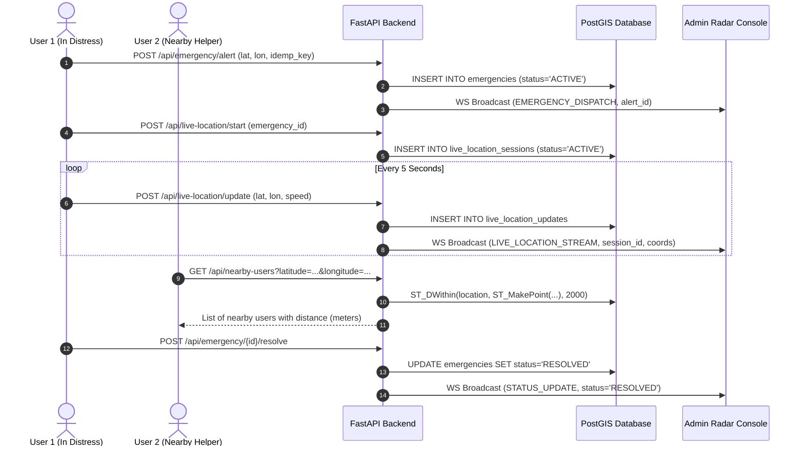

# Bhai App System Architecture

## 1. High-Level Architecture Overview

**Bhai App** is a mission-critical, production-ready emergency assistance and live-location streaming platform built on a dual-rail transport architecture:
1. **Air Rail (Offline BLE Peer-to-Peer Mesh)**: Enables immediate, local discovery and alert propagation directly between nearby devices over Bluetooth Low Energy (2.4 GHz) without cellular data, SIM cards, or internet servers.
2. **Cloud Rail (FastAPI + PostGIS + WebSockets)**: Provides encrypted centralized dispatch, sub-second WebSocket broadcasting, high-frequency 5-second live telemetry streaming, and a dedicated, real-time command center for administrative operators.

```
+-----------------------------------------------------------------------------+
|                                BHAI APP PLATFORM                            |
+-----------------------------------------------------------------------------+
               |                                             |
               v                                             v
     +-------------------+                         +-------------------+
     |   Flutter Mobile  |                         |  Dedicated Admin  |
     |   (Android App)   |<--- WebSocket / REST -->|   Radar Console   |
     +-------------------+                         +-------------------+
               |                                             |
     [BLE Mesh Broadcast]                          [Live GIS Map Radar]
               |                                             |
               +----------------------+----------------------+
                                      |
                                      v
                      +-------------------------------+
                      |      FastAPI Backend Core     |
                      |  - JWT Role-Based Auth        |
                      |  - Scoped Idempotency         |
                      |  - 5s Live Telemetry Engine   |
                      |  - Realtime WS Connection Hub |
                      +-------------------------------+
                                      |
                                      v
                      +-------------------------------+
                      |     PostgreSQL 16 + PostGIS   |
                      |  - Spatial Geography Indexes  |
                      |  - ST_DWithin / ST_Distance   |
                      |  - Multi-tenant Isolated Data |
                      +-------------------------------+
```

---

## 2. Multi-User Concurrency & Session Isolation

The platform enforces complete multi-user isolation across all state mutations, eliminating legacy bugs where a single user's action could cancel or corrupt other incidents:

- **Independent Emergency Lifecycle**: Every emergency incident has a unique `alert_id` (UUIDv4) and is strictly bound to `user_id`. An emergency state transition (`ACTIVE` -> `ACKNOWLEDGED` -> `RESOLVED` / `CANCELLED`) operates solely on that incident record.
- **Independent Live Location Streams**: Live location sharing runs in an isolated `live_location_sessions` record keyed by `session_id` (UUIDv4). Each user or incident streams location updates independently every 5 seconds. Stopping one session does not affect any other concurrent session.
- **Scoped Idempotency Control**: Idempotency keys (`idempotency_key`) are verified against `(user_id, idempotency_key)` tuples. This guarantees that two distinct users utilizing coincidentally identical offline-generated local keys never collide or reject each other's alerts.



---

## 3. Realtime Dual-Rail Mesh Architecture

### Dual-Rail Transport Protocol

```
+---------------------------------------------------------------------------------+
|                                 DUAL-RAIL DISPATCH                              |
+---------------------------------------------------------------------------------+
           |                                                      |
    [ONLINE PATH]                                          [OFFLINE PATH]
           |                                                      |
           v                                                      v
  HTTP/2 & WebSockets                                   BLE 2.4 GHz Advertising
  - REST payload via TLS                                - Custom 24-byte Manufacturer Data
  - Instant server broadcast                            - 'BHAI' (0x42 0x48 0x41 0x49) Header
  - Global dispatch to admin                            - Sub-second relay between phones
  - Store-and-forward queue fallback                    - Zero SIM / cellular required
```

### BLE Packet Specification
The offline air rail utilizes Bluetooth Low Energy advertising packets with standard manufacturer identifier `0xFFFF`:
- **Bytes 0-3**: Magic Header `BHAI` (`0x42, 0x48, 0x41, 0x49`)
- **Byte 4**: Packet Type (`0x01`: Presence Beacon, `0x02`: Emergency SOS Alert, `0x03`: Alert ACK)
- **Bytes 5-8**: Sender Ephemeral ID (4 bytes)
- **Bytes 9-12**: Target Ephemeral ID (4 bytes, for directed ACK)
- **Byte 13**: Sequence & TTL Nonce (1 byte)

---

## 4. 5-Second Live Location Telemetry Engine

Live location streaming provides second-by-second tactical situational awareness:
1. **Session Initialization**:
   - `POST /api/live-location/start` creates an active session bound to the user's authenticated account and optional emergency ID.
2. **Periodic Streaming**:
   - The mobile client runs a non-blocking `Timer.periodic(const Duration(seconds: 5))` stream.
   - Updates are posted to `POST /api/live-location/update` with GPS latitude, longitude, accuracy, heading, altitude, and speed.
   - Non-blocking async queue updates PostgreSQL and broadcasts realtime telemetry to connected admin consoles.
3. **Session Termination**:
   - `POST /api/live-location/stop` transitions the session to `STOPPED` and terminates periodic mobile timers.
   - Automatic server-side expiry cleans up sessions idle for greater than 60 minutes.

---

## 5. Standalone Web Admin Radar Console

The Admin Console (`/admin`) is built with pure standards-compliant HTML5/CSS3/ES6 and Leaflet.js:
- **No Heavy Framework Overhead**: Loads instantaneously with zero npm build step or bundler dependencies.
- **Live Spatial Radar**: Renders active emergencies as high-visibility pulsing red markers and 5-second live telemetry streams as glowing teal tracking lines.
- **Turn-by-Turn Navigation**: One-click deep link to Google Maps driving directions using exact coordinates:
  `https://www.google.com/maps/dir/?api=1&destination=LATITUDE,LONGITUDE`
- **Native Web Share Integration**: Invokes the browser's `navigator.share` API on mobile devices and provides an automated clipboard fallback on desktop.
- **WebSocket Reconnection**: Automatically connects to `/ws/admin` with exponential backoff and periodic fallback polling to ensure zero data loss during network hiccups.

---

## 6. Database Schema & PostGIS Indexing

The storage layer runs on PostgreSQL 16 with the PostGIS spatial extension enabled.

```sql
-- Spatial queries leverage geography(Point, 4326) with GIST indexing
CREATE INDEX idx_emergencies_location ON emergencies USING GIST (
    ST_SetSRID(ST_MakePoint(longitude, latitude), 4326)::geography
);

CREATE INDEX idx_live_loc_updates_session ON live_location_updates (session_id, recorded_at DESC);
CREATE INDEX idx_live_loc_sessions_active ON live_location_sessions (status, updated_at DESC);
```

### Geospatial Filtering
The `/api/nearby-users` endpoint executes spatial radius queries:
```sql
SELECT user_id, latitude, longitude,
       ST_Distance(
           ST_SetSRID(ST_MakePoint(longitude, latitude), 4326)::geography,
           ST_SetSRID(ST_MakePoint(:query_lon, :query_lat), 4326)::geography
       ) AS distance_meters
FROM helper_presence
WHERE is_available = true
  AND ST_DWithin(
      ST_SetSRID(ST_MakePoint(longitude, latitude), 4326)::geography,
      ST_SetSRID(ST_MakePoint(:query_lon, :query_lat), 4326)::geography,
      :radius_meters
  )
ORDER BY distance_meters ASC;
```

---

## 7. Security Architecture

1. **Authentication & Access Control**:
   - Role-Based Access Control (RBAC) separates standard mobile users (`USER`) from administrative operators (`ADMIN`).
   - Admin routes strictly verify `role == "ADMIN"`, rejecting unauthorized users with `403 Forbidden` and unauthenticated callers with `401 Unauthorized`.
2. **Session Ownership Enforcement**:
   - Modifying or terminating a live location stream requires either matching `session.user_id == current_user.id` or administrative privileges. Cross-tenant tampering is strictly prevented.
3. **Data Protection & Privacy**:
   - Location history retention policies automatically purge expired telemetry older than 90 days.
   - In offline mode, sensitive alert data stored locally in SQLite is encrypted with AES-256 before storage.
